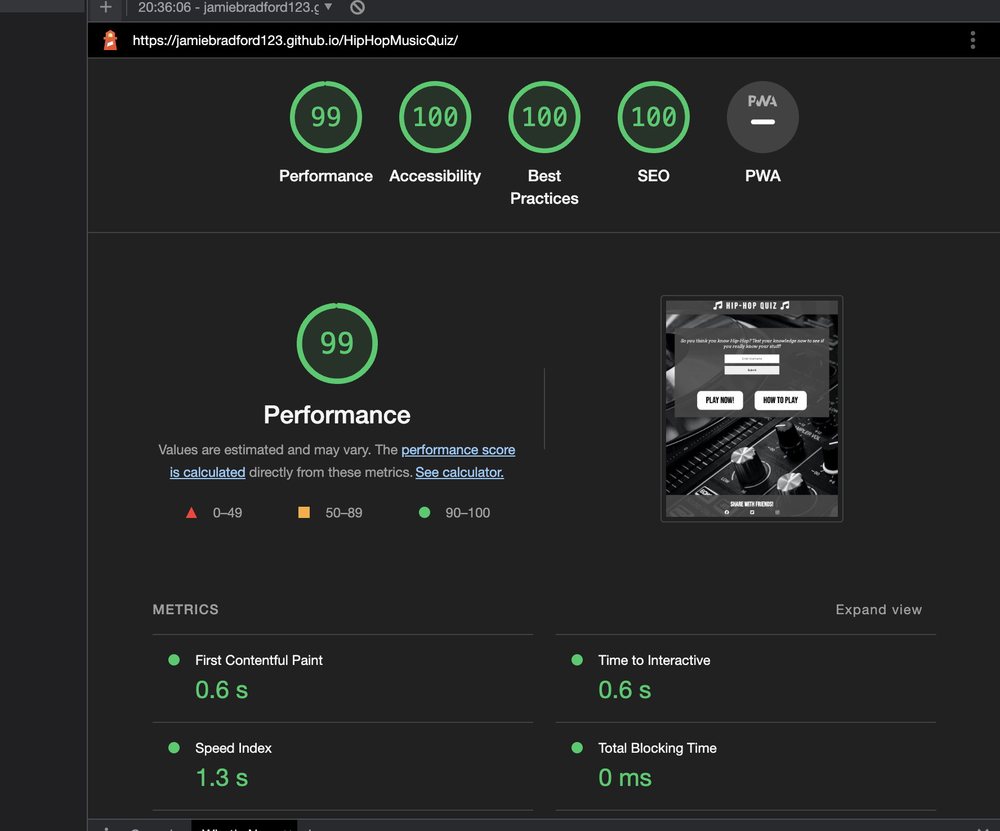
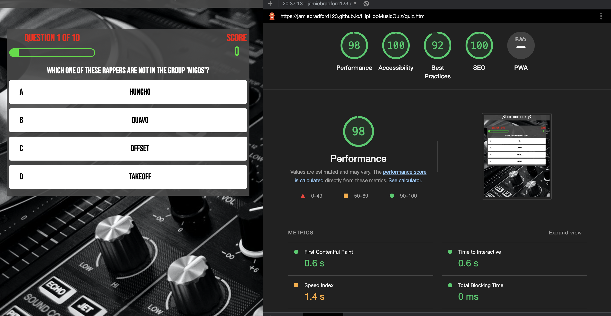
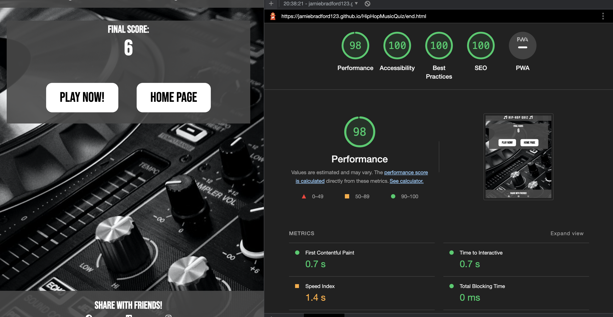

# Hip Hop Quiz

TO RUN LOCALLY, RUN THE FOLLOWING IN THE TERMINAL:
python3 -m http.server

The aim of this project is to build a Hip-Hop Music quiz using HTML, CSS and Javascript. For this project to be successful, it must provide a fun user expereince by having a responsive well working quiz. Achieving this means that all the functions work as they should, and clicking on one of the answers provides feedback.
The intended target of this website is anyone who is a fan of Hip-Hop. This quiz provides them to test their knowledge and also discover some fun facts they may not have known. 

## Features 
Find below all the features which will be implimented on the quiz

### Existing Features

- __Hip-Hop music quiz heading__

  - Provides a large clear title at the top of the page which gives the user a clear indication of what this website is. 
  - Clicking on the main header will also take the user back the the home page

- __The Game Area on the Home Page__

  - On the home page, this area will contain short introductionary text, an option to provide a username and two buttons: Play Now and How to Play
  - A form to allow the user to enter their username, which will pop up a personal welcome message
  - The Play Now button will take the user to the first question of the quiz
  - The How to Play Button will display a Modal with some greater detail about the quiz- number of questions, how to answer etc.

- __The Footer__

  - This section will contain links which will allow the user to share the Quiz link with friends on different social media platforms.

- __The game area on the quiz page__

  - This section will allow the user to complete the quiz. In this area will contain the following:
    - A question meter bar so users can see which number question they are on and have a visual indicator of how far along the quize they are
    - A Score indicator which will show how many points (correct answers) the user has achieved, allowing them to track their performance
    - The Question - 10 fixed questions which will display in a randomised order each time the quiz is opened. This is what the user will have to answer
    - 4 answer options- A,B,C,D. The user will choose what they believe to be the correct answer. If the answer is correct, the box will display green and add 1 point to their socre. If they choose the incorrect answer then they box will display red and no point will be awarded. Displaying right and wrong answers in different colors allows the user to get clear instant feedback. 

- __End Page__

  - Once the quiz has been completed, user will be taken to this final page, which will display their final score and allow them to enter their username to save their score. 
  - The two buttons on this page will either take the user to the start of the quiz so they can play again or take them back to the Home Page

### Features Left to Implement

- Timer- add a quiz timer to increase the difficulty of the quiz and reduce the likelihood of someone searching up the answers
- Difficulty settings- provide the option of choosing Easy, Medium or Hard questions to make the quiz more interesting for the user and keep them on the site for longer
- Leaderboard - allowing users to compare their scores with others on the site

## Testing 

- HTML
    - No errors were returned when passing through the official [W3C validator](https://validator.w3.org/nu/?doc=https%3A%2F%2Fjamiebradford123.github.io%2FHipHopMusicQuiz%2F)
    
- CSS
    - No errors were found when passing through the official [(Jigsaw) validator](https://jigsaw.w3.org/css-validator/validator?uri=https%3A%2F%2Fjamiebradford123.github.io%2FHipHopMusicQuiz%2F&profile=css3svg&usermedium=all&warning=1&vextwarning=&lang=en)
- JavaScript
    - No errors were found when passing through the official [Jshint validator](https://jshint.com/)
      - The following metrics were returned: 
      - There are 7 functions in this file.
      - Function with the largest signature take 1 arguments, while the median is 1.
      - Largest function has 12 statements in it, while the median is 2.
      - The most complex function has a cyclomatic complexity value of 4 while the median is 1.
- Lighthouse test
    - 
    - 
    - 

## Deployment
- The site was deployed to GitHub pages. The steps to deploy are as follows: 
  - In the GitHub repository, navigate to the Settings tab 
  - On the left hand side there is a pages tab
  - Select main branch and save

The live link can be found here - https://jamiebradford123.github.io/HipHopMusicQuiz/

## Credits 
- Content for the quiz was taken from: https://www.capitalxtra.com/features/lists/hip-hop-pub-quiz-questions-best/
- Code to help create the modal was taken from: https://www.w3schools.com/howto/tryit.asp?filename=tryhow_css_modal2
- Instructions on how to create a wroking quiz was taken from: https://www.youtube.com/watch?v=f4fB9Xg2JEY
- The icons in the header were taken from [Font Awesome](https://fontawesome.com/)
- Links in the footer to share the link to the website was from: https://www.sharelinkgenerator.com/
- Code to allow user to add their username assisted using this module on Code Institute: https://learn.codeinstitute.net/courses/course-v1:CodeInstitute+JSE_PAGPPF+2021_Q2/courseware/30137de05cd847d1a6b6d2c7338c4655/c3bd296fe9d643af86e76e830e1470dd/
- Background image is a Photo by Stephen Niemeier from Pexels: https://www.pexels.com/photo/black-and-silver-mixing-board-63703/

