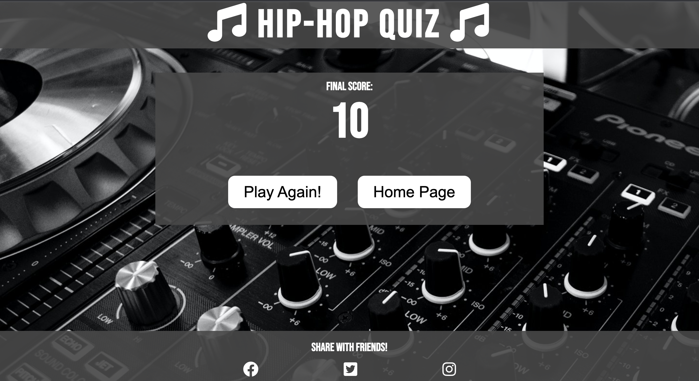

# Hip Hop Quiz

The aim of this project is to build a Hip-Hop Music quiz using HTML, CSS and Javascript. For this project to be successful, it must provide a fun user expereince by having a responsive well working quiz. Achieving this means that all the functions work as they should, and clicking on one of the answers provides feedback.
The intended target of this website is anyone who is a fan of Hip-Hop. This quiz provides them to test their knowledge and also discover some fun facts they may not have known. 

## Features 
Find below all the features which will be implimented on the quiz

### Existing Features

- __Hip-Hop music quiz heading__

  - Provides a large clear title at the top of the page which gives the user a clear indication of what this website is. 
  - Clicking on the main header will also take the user back the the home page

- __The Game Area on the Home Page__

  - On the home page, this area will contain short introductionary text, an option to provide a username and two buttons: Play Now and How to Play
  - A form to allow the user to enter their username, which will pop up a personal welcome message
  - The Play Now button will take the user to the first question of the quiz
  - The How to Play Button will display a Modal with some greater detail about the quiz- number of questions, how to answer etc.

- __The Footer__

  - This section will contain links which will allow the user to share the Quiz link with friends on different social media platforms.

- __The game area on the quiz page__

  - This section will allow the user to complete the quiz. In this area will contain the following:
    - A question meter bar so users can see which number question they are on and have a visual indicator of how far along the quize they are
    - A Score indicator which will show how many points (correct answers) the user has achieved, allowing them to track their performance
    - The Question - 10 fixed questions which will display in a randomised order each time the quiz is opened. This is what the user will have to answer
    - 4 answer options- A,B,C,D. The user will choose what they believe to be the correct answer. If the answer is correct, the box will display green and add 1 point to their socre. If they choose the incorrect answer then they box will display red and no point will be awarded. Displaying right and wrong answers in different colors allows the user to get clear instant feedback. 

- __End Page__

  - Once the quiz has been completed, user will be taken to this final page, which will display their final score and allow them to enter their username to save their score. 
  - The two buttons on this page will either take the user to the start of the quiz so they can play again or take them back to the Home Page

### Features Left to Implement

- Timer- add a quiz timer to increase the difficulty of the quiz and reduce the likelihood of someone searching up the answers
- Difficulty settings- provide the option of choosing Easy, Medium or Hard questions to make the quiz more interesting for the user and keep them on the site for longer
- Leaderboard - allowing users to compare their scores with others on the site

## Testing 

In this section, you need to convince the assessor that you have conducted enough testing to legitimately believe that the site works well. Essentially, in this part you will want to go over all of your project’s features and ensure that they all work as intended, with the project providing an easy and straightforward way for the users to achieve their goals.

In addition, you should mention in this section how your project looks and works on different browsers and screen sizes.

You should also mention in this section any interesting bugs or problems you discovered during your testing, even if you haven't addressed them yet.

If this section grows too long, you may want to split it off into a separate file and link to it from here.

### Validator Testing 

- HTML
    - No errors were returned when passing through the official [W3C validator](https://validator.w3.org/nu/?doc=https%3A%2F%2Fjamiebradford123.github.io%2FHipHopMusicQuiz%2F)
    
- CSS
    - No errors were found when passing through the official [(Jigsaw) validator](https://jigsaw.w3.org/css-validator/validator?uri=https%3A%2F%2Fvalidator.w3.org%2Fnu%2F%3Fdoc%3Dhttps%253A%252F%252Fcode-institute-org.github.io%252Flove-maths%252F&profile=css3svg&usermedium=all&warning=1&vextwarning=&lang=en)
- JavaScript
    - No errors were found when passing through the official [Jshint validator](https://jshint.com/)
      - The following metrics were returned: 
      - There are 11 functions in this file.
      - Function with the largest signature takes 2 arguments, while the median is 0.
      - Largest function has 10 statements in it, while the median is 3.
      - The most complex function has a cyclomatic complexity value of 4 while the median is 2.

### Unfixed Bugs

You will need to mention unfixed bugs and why they were not fixed. This section should include shortcomings of the frameworks or technologies used. Although time can be a big variable to consider, paucity of time and difficulty understanding implementation is not a valid reason to leave bugs unfixed. 

## Deployment

This section should describe the process you went through to deploy the project to a hosting platform (e.g. GitHub) 

- The site was deployed to GitHub pages. The steps to deploy are as follows: 
  - In the GitHub repository, navigate to the Settings tab 
  - From the source section drop-down menu, select the Master Branch
  - Once the master branch has been selected, the page will be automatically refreshed with a detailed ribbon display to indicate the successful deployment. 

The live link can be found here - https://code-institute-org.github.io/love-maths/

## Credits 

https://www.w3schools.com/howto/tryit.asp?filename=tryhow_css_modal2

https://www.youtube.com/watch?v=f4fB9Xg2JEY

https://www.sharelinkgenerator.com/

In this section you need to reference where you got your content, media and extra help from. It is common practice to use code from other repositories and tutorials, however, it is important to be very specific about these sources to avoid plagiarism. 

You can break the credits section up into Content and Media, depending on what you have included in your project. 

### Content 
https://www.capitalxtra.com/features/lists/hip-hop-pub-quiz-questions-best/
- The text for the Home page was taken from Wikipedia Article A
- Instructions on how to implement form validation on the Sign Up page was taken from [Specific YouTube Tutorial](https://www.youtube.com/)
- The icons in the footer were taken from [Font Awesome](https://fontawesome.com/)

### Media
Photo by Stephen Niemeier from Pexels: https://www.pexels.com/photo/black-and-silver-mixing-board-63703/ - backgorund image
- The photos used on the home and sign up page are from This Open Source site
- The images used for the gallery page were taken from this other open source site
